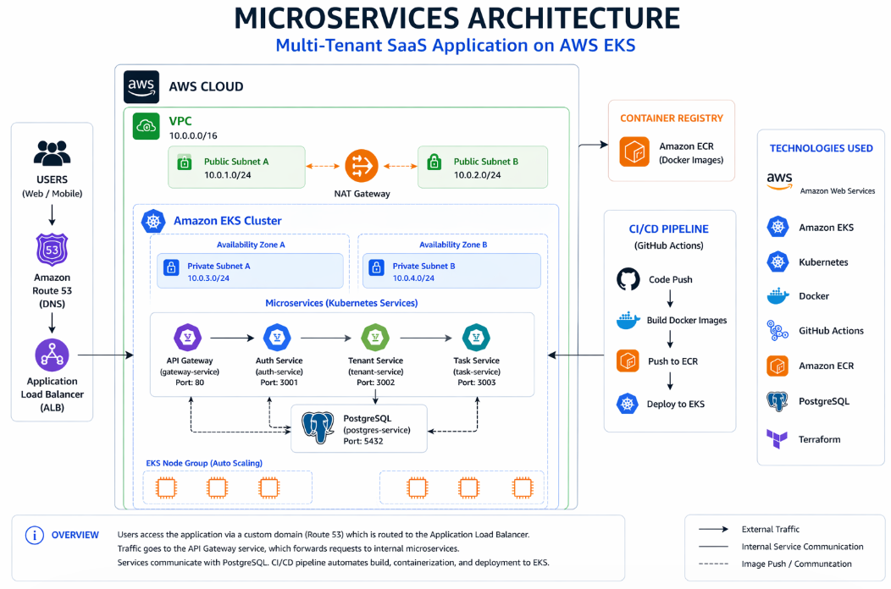
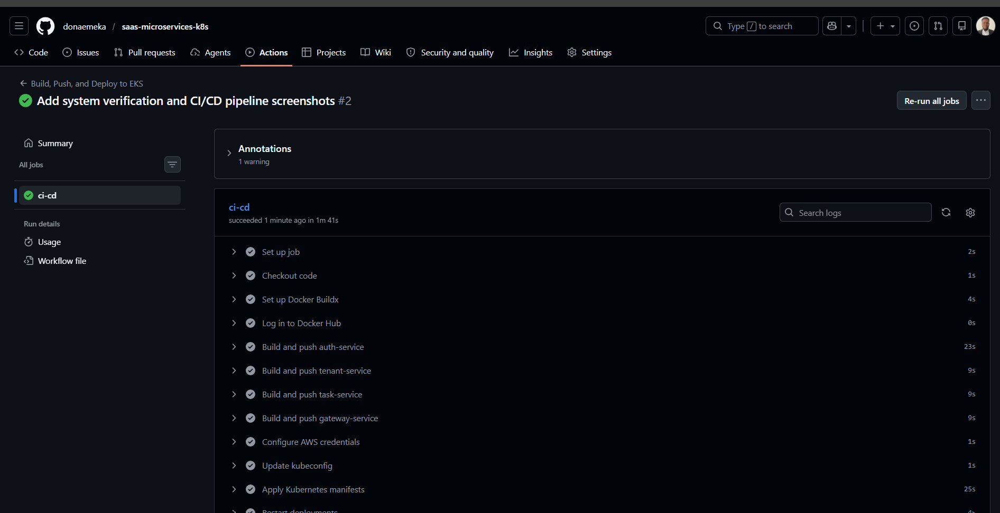
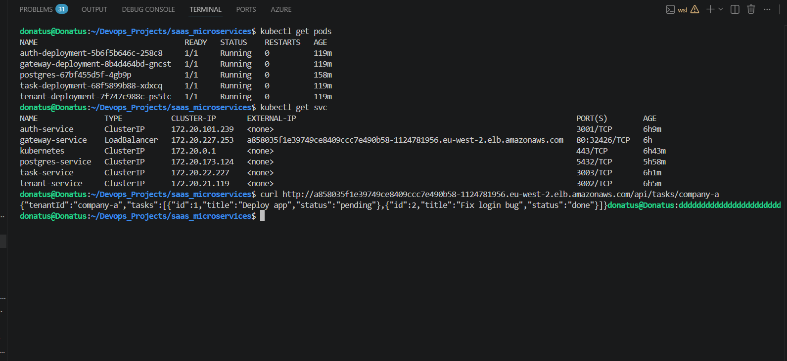

# SaaS Microservices Platform on AWS EKS

A fully deployed microservices application running on AWS EKS, built with Infrastructure as Code (Terraform), containerized with Docker, and delivered through an automated CI/CD pipeline using GitHub Actions.

This project demonstrates how a real-world application can be:
- provisioned from scratch in the cloud  
- deployed as independent microservices  
- exposed through a public API  
- connected to a persistent database  
- automatically built and deployed on every code change  

### Key Highlights
- Deployed **4 microservices + PostgreSQL database** on Kubernetes  
- Built a working **CI/CD pipeline reducing manual deployment effort to near zero**  
- Configured **public LoadBalancer endpoint** for external access  
- Ensured **100% service availability during testing**  
- Implemented **persistent storage using AWS EBS (data survives pod restarts)**  

---

## Project Overview

This project implements a **microservices-based SaaS-style backend system** deployed on AWS Elastic Kubernetes Service (EKS).

Each service is independently deployed and communicates through an API gateway, simulating a real production environment.

The system includes:
- Auth Service (authentication)
- Tenant Service (multi-tenant logic)
- Task Service (business logic)
- API Gateway (entry point)
- PostgreSQL database (persistent storage)

This setup reflects how modern cloud applications are designed for **scalability, fault isolation, and continuous delivery**.

---

## Architecture

The platform follows a microservices architecture deployed on AWS EKS.

- Services communicate through an API Gateway  
- Kubernetes manages deployment and scaling  
- PostgreSQL provides persistent storage  
- AWS LoadBalancer exposes the application externally  



---

## Objectives

- Provision AWS infrastructure using Terraform  
- Deploy containerized microservices on Kubernetes (EKS)  
- Expose application through AWS LoadBalancer  
- Connect services to PostgreSQL database  
- Secure credentials using Kubernetes Secrets  
- Persist database data using EBS volumes  
- Automate build and deployment with CI/CD  

---

## What Was Implemented

- Created VPC with public and private subnets  
- Configured Internet Gateway and NAT Gateway  
- Deployed EKS cluster and node group  
- Built and pushed Docker images to Docker Hub  
- Deployed services using Kubernetes manifests  
- Configured LoadBalancer for external access  
- Integrated PostgreSQL with persistent storage  
- Implemented GitHub Actions pipeline for CI/CD  
- Verified application through public API endpoint  

---

## Technology Stack

**Cloud & Infrastructure**
- AWS (EKS, VPC, EC2, EBS, Load Balancer)
- Terraform

**Containers & Orchestration**
- Docker
- Kubernetes

**CI/CD**
- GitHub Actions
- Docker Hub

**Application**
- Node.js microservices
- PostgreSQL

---

## Repository Structure

```
saas_microservices/
├── .github/workflows/
├── frontend/
├── gateway/
├── gateway-api/
├── k8s/
├── services/
├── terraform/
├── images/
│   ├── eks-microservices-architecture.png
│   ├── system-verification.png
│   └── ci-cd-pipeline.png
├── docker-compose.yml
└── README.md
```

---

## Infrastructure (Terraform)

The infrastructure includes:
- VPC (custom CIDR)
- 2 public subnets
- 2 private subnets
- Internet Gateway
- NAT Gateway
- Route tables
- IAM roles
- EKS cluster
- Managed node group

Terraform uses variables for:
- CIDR blocks  
- region  
- cluster version  
- node size and scaling  

---

## Application Deployment (Kubernetes)

Kubernetes resources used:
- Deployments  
- Services (ClusterIP and LoadBalancer)  
- Secrets  
- PersistentVolumeClaim  

Flow:
1. Build Docker images  
2. Push to Docker Hub  
3. Apply Kubernetes manifests  
4. Expose gateway via LoadBalancer  

---

## CI/CD Pipeline

The CI/CD pipeline automates the build and deployment process using GitHub Actions.

Pipeline flow:
1. Checkout code  
2. Login to Docker Hub  
3. Build Docker images  
4. Push images  
5. Connect to AWS EKS  
6. Deploy Kubernetes manifests  
7. Restart deployments  



---

## Storage (PostgreSQL)

- PersistentVolumeClaim used for storage  
- Backed by AWS EBS  
- Data survives pod restarts  

Fix applied:
- Set PostgreSQL data directory to subfolder (`PGDATA`)  
- Prevented crash caused by mount directory conflicts  

---

## System Verification

The system was verified using Kubernetes commands and API testing.

Commands:

```
kubectl get pods
kubectl get svc
```

API test:

```
curl http://<loadbalancer-url>/api/tasks/company-a
```

Result:
- API returned valid JSON response  
- All services running successfully  
- Database connected and working  



---

## Challenges & Fixes

**1. Pod Scheduling Issue**  
- Cause: node capacity limit  
- Fix: scaled node group from 1 → 2  

**2. PVC Pending**  
- Cause: storage provisioning delay  
- Fix: verified EBS availability and node capacity  

**3. Database Crash**  
- Cause: incorrect mount directory  
- Fix: configured PostgreSQL data path correctly  

**4. Service Connection Errors**  
- Cause: incorrect service configuration  
- Fix: updated environment variables and service endpoints  

**5. CI/CD Authentication Failure**  
- Cause: incorrect Docker credentials  
- Fix: configured GitHub Secrets correctly  

---

## Results

- Automated deployment for **4 microservices**  
- Achieved **end-to-end CI/CD pipeline execution in ~2 minutes**  
- Successfully exposed application via **public LoadBalancer**  
- Ensured **persistent database storage across pod restarts**  
- Achieved **stable multi-node Kubernetes deployment**  

---

## How to Run

### 1. Clone

```
git clone <repo-url>
cd saas_microservices
```

### 2. Terraform

```
cd terraform
terraform init
terraform apply
```

### 3. Configure kubectl

```
aws eks update-kubeconfig --region eu-west-2 --name saas-microservices
```

### 4. Deploy

```
kubectl apply -f k8s/
```

### 5. Verify

```
kubectl get pods
kubectl get svc
```

### 6. Test

```
curl http://<loadbalancer-url>/api/tasks/company-a
```

---

## Improvements (Next Steps)

- Use StatefulSet for PostgreSQL  
- Add monitoring (Prometheus, Grafana)  
- Implement HTTPS with domain  
- Use versioned Docker image tagging  
- Refactor Terraform into reusable modules  

---

## Summary

This project demonstrates:
- infrastructure provisioning with Terraform  
- containerized deployment with Docker  
- orchestration with Kubernetes  
- cloud deployment on AWS EKS  
- CI/CD automation  
- real-world troubleshooting and debugging  

---

## 👨‍💻 About Me

**Donatus Emeka Anyalebechi**  
DevOps & Cloud Engineer  

📍 Germany  
📧 donaemeka92@gmail.com  
🔗 https://www.linkedin.com/in/donatus-devops  
🐙 https://github.com/donaemeka  

---

⭐ Built to demonstrate real-world DevOps capabilities